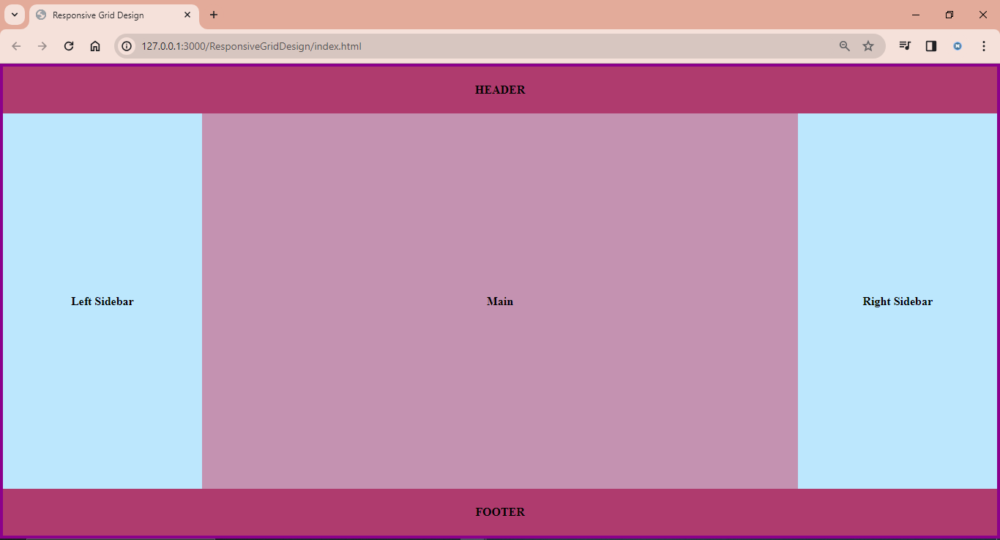
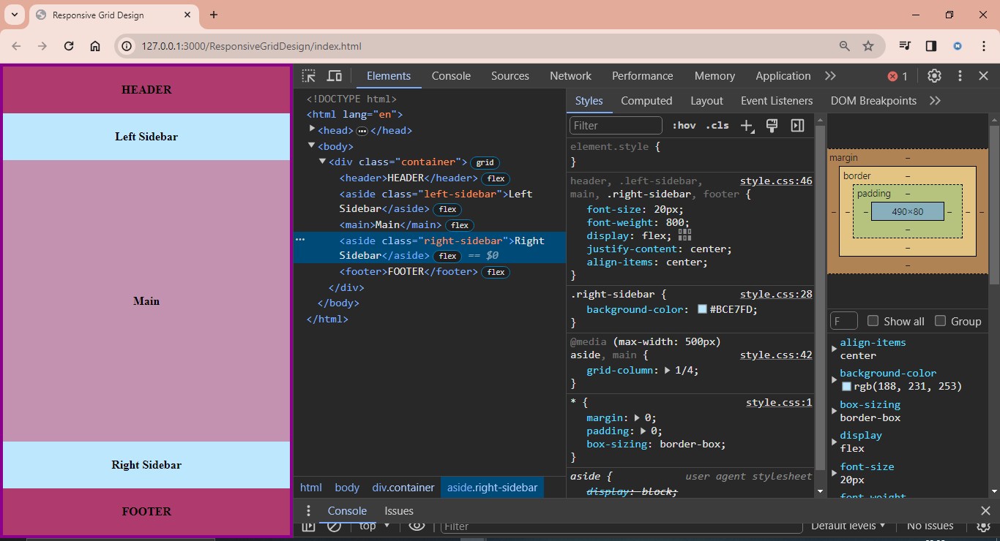

# ResponsiveGridDesign

A simple web page layout project that demonstrates a responsive grid design using HTML and CSS.

## Description

This project showcases a basic web page layout. It includes a header, left sidebar, main content area, right sidebar, and a footer. The layout is designed to be responsive, adapting to different screen sizes.

## Usage

You can view the project by opening the `index.html` file in your web browser. You can also clone the repository to your local machine for further exploration or modification.

## Screenshots

### 1. Screen width 

### 2. Screen width less and equal to 500px 

## Author

Navneet Singh